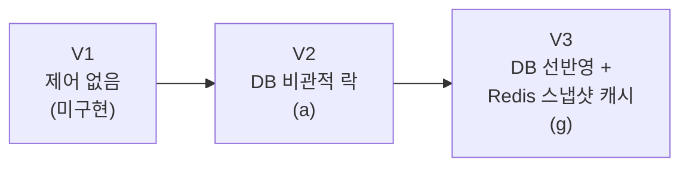
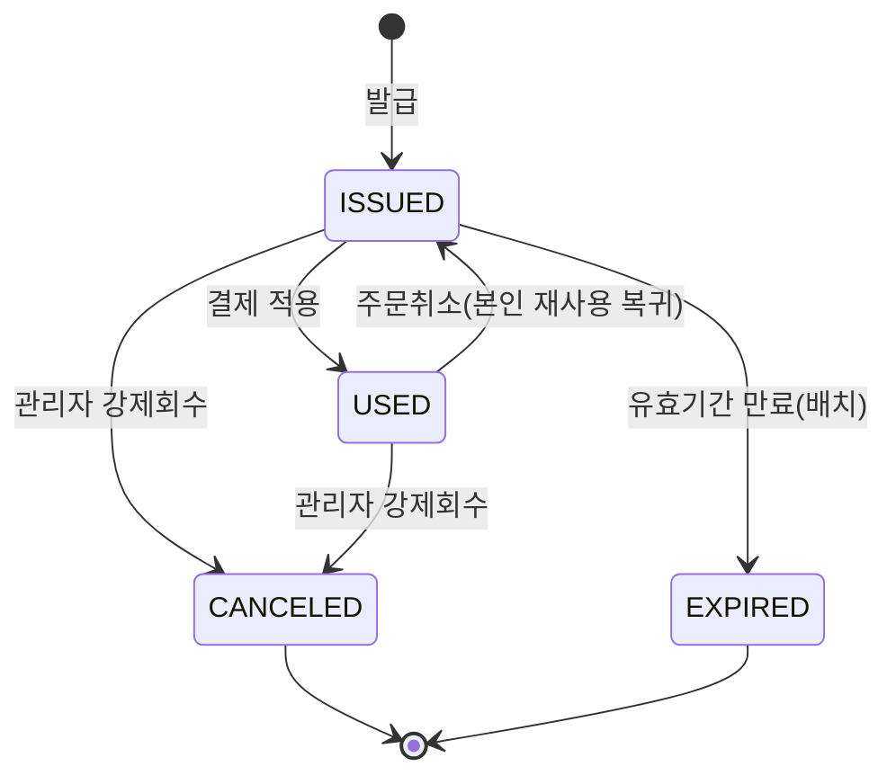

# 🎫 밀리버릿 (Mealiver-IT)
> 배달앱 오픈런 선착순 쿠폰 발급 시스템

[](https://openjdk.org/)
[](https://spring.io/projects/spring-boot)
[](https://www.mysql.com/)
[](https://redis.io/)
[](https://www.docker.com/)

---

## 📌 목차

1. [프로젝트 소개](#1-프로젝트-소개)
2. [팀원 소개](#2-팀원-소개)
3. [기술 스택](#3-기술-스택)
4. [시스템 아키텍처](#4-시스템-아키텍처)
5. [인프라 & 배포](#5-인프라--배포)
6. [ERD](#6-erd)
7. [핵심 기능](#7-핵심-기능)
   - [동시성 제어 — 선착순 발급](#7-1-동시성-제어--선착순-발급)
   - [쿠폰 상태 로직](#7-2-쿠폰-상태-로직)
   - [Idempotency 설계](#7-3-idempotency-설계)
   - [멤버십 등급 시스템](#7-4-멤버십-등급-시스템)
   - [정합성 자기검증](#7-5-정합성-자기검증)
   - [더미데이터 파이프라인](#7-6-더미데이터-파이프라인)

---

## 1. 프로젝트 소개

### 배경

U+ 유레카 백엔드 과정 종합프로젝트 과제로 주어진 "대규모 트래픽 선착순 쿠폰 발급 시스템"을, **배달 서비스에서 매일 오전 11시 정각에 여는 오픈런 할인쿠폰** 시나리오로 구체화한 프로젝트입니다.

### 목표

| 목표 | 해결 기술 |
|---|---|
| 재고 10,000장·동시요청 20,000건에도 초과발급 0건, 1인 1매 | DB unique 제약 + 비관적 락(MVP) → DB 선반영+Redis 스냅샷 캐시(하드닝, 구현 완료, [2026-08-20] Redis 이중 카운터 계획에서 변경) |
| 300만 건 발급이력 전체에 대한 결정론적 정합성 자기검증 | 재실행 시 동일 결과가 나오는 검증 SQL 5종 + 오염 데이터 탐지 검증(구현·실행 완료) + Spring Batch 자동화(Phase 3 선택 확장) |
| 회원 등급별 차등 혜택 (이등병~병장 4단계) | 완료 주문 수 기준 매월 1일 자동 재산정 배치 |
| 100만 유저·300만 발급이력 규모 실증 | 청크 배치 시더 + `rewriteBatchedStatements` 기반 대량 적재 파이프라인 |

### 프로젝트 기간

```
2026.08.06 ~ 2026.08.31
```

---

## 2. 팀원 소개

**6인 · 4역할**로 구성되어 있습니다.

| 역할 | 이름 | 담당 도메인 |
|---|---|---|
| 인프라·발급 API (발급 로직) | 김⁠어⁠진 | `CouponIssuanceService`, 재고 예약 전략(비관적 락 → Redis 스냅샷 캐시, [2026-08-20] 이중 카운터 계획에서 변경) |
| 발급 API (상태전이 로직) | 이⁠진⁠희 | 상태전이 API, 상태 머신, idempotency |
| 데이터·검증배치 (더미데이터) | 윤⁠태⁠형 | 더미데이터 시더(유저/오더/등급/캠페인/발급이력) |
| 데이터·검증배치 (검증 SQL+PII) | 정⁠민⁠주 | 정합성 검증 배치(`ConsistencyVerificationJob`), PII 마스킹 컨버터/시리얼라이저 |
| 부하테스트 | 이⁠호⁠성 | k6 부하테스트(유저 20,000명 중복없음 / ramp-up 60초), Redis |
| 프론트 | 소⁠서⁠아 | 이벤트/결제 페이지, 실시간 재고 카운트다운 화면 등 |

---

## 3. 기술 스택

### Backend

| 분류 | 기술 |
|---|---|
| 언어 / 프레임워크 |    |
| ORM |  |
| 배치 | Spring `@Scheduled` + ShedLock(분산락) — 등급 재산정(`MembershipTierBatchJob`), 쿠폰 만료(`CouponExpirationBatchJob`) 구현 완료. 정합성 검증 자동화(`ConsistencyVerificationJob`, Spring Batch)는 Phase 3 선택 확장 |
| 재시도 / 이벤트 |  상태전이 동시성 재시도, `@TransactionalEventListener(AFTER_COMMIT)` + `@Async` 기반 알림 분리 |
| 분산 캐시 / 락 |  — DB 선반영+스냅샷 캐시 기반 사전필터 (구현·연동 완료, [2026-08-20] 이중 카운터 게이트 계획에서 변경) |

### Database

| 분류 | 기술 |
|---|---|
| RDBMS |  |
| 마이그레이션 | Flyway |

### Infra

| 분류 | 기술 |
|---|---|
| 컨테이너 |  — `Mealiver-IT-Infra` 레포 docker-compose로 MySQL/Redis/Kafka(+UI)/Prometheus/Grafana/Adminer/API/FE 전체 스택 구성 완료 |
| 원격 DB | Tailscale로 연결되는 팀 공유 MySQL |
| CI | GitHub Actions — `main` 브랜치 push 시 Docker 이미지 빌드 후 GHCR에 푸시 |

---

## 4. 시스템 아키텍처


---

## 5. 인프라 & 배포

```
로컬 개발 (local 프로필)
   └─ Docker MySQL 컨테이너
팀 공유 개발 (remote 프로필)
   └─ Tailscale로 연결되는 학원 공용 서버
      └─ Mealiver-IT-Infra의 docker-compose로 MySQL, Redis, Kafka(+UI),
         Prometheus, Grafana, Adminer, API, FE를 한 번에 기동
```

- `Mealiver-IT-Infra` 레포에 `docker-compose.yml`로 인프라 전체 구성 완료. Redis는 재고 스냅샷 캐시(V3, [2026-08-20] 구현·연동 완료)로 사용 중이며, Kafka 컨테이너는 아직 애플리케이션에서 사용하지 않습니다(Phase 4 선택 확장).
- Grafana에 쿠폰 발급 DB 모니터링 대시보드 구축 완료 — 캠페인 재고 현황, 초당 발급 추이, 활성 DB 커넥션, InnoDB 락 대기 현황을 실시간으로 시각화(Phase 3 "DB 비관적 락 vs Redis 성능 비교" 발표용).
- GitHub Actions로 `main` 브랜치 push 시 Docker 이미지를 빌드해 GHCR에 푸시.
- 별도 클라우드 프로덕션 배포는 하지 않고, 로컬 및 팀 공유 환경에서 개발·검증합니다.

---

## 6. ERD


### 테이블 설명

| 테이블 | 설명 | 주요 컬럼 / 제약 |
|---|---|---|
| `users` | 회원(가상 데이터). 로그인/인증은 구현하지 않고 계급 산정용 데이터로만 사용 | `membership_tier`(현재 등급, 배치가 갱신), `tier_calculated_at` / `uk_users_login_id` |
| `orders` | 계급 산정용 결제완료 이력. 실제 주문 UI는 프론트 정적 mockup, 이 테이블은 등급 배치가 집계하는 근거 데이터 | `status`, `completed_at` / `idx_orders_tier_calc(user_id, status, completed_at)` — 등급 배치가 완료 주문 수를 집계할 때 사용 |
| `membership_tier_log` | 등급 재산정 배치(`MembershipTierBatchJob`) 감사 로그. 등급이 실제로 바뀐 유저만 기록 | `from_tier`, `to_tier`, `order_count` |
| `campaign` | 선착순 발급 이벤트(캠페인) 마스터. 재고·오픈 기간·회원 등급 제한을 가짐 | `total_stock`/`remaining_stock`(V2 `reserve()`가 직접 갱신, [2026-08-20] 별도 DB 백스톱 계획에서 변경 — Redis 스냅샷 캐시가 이 값을 사후에 복사), `min_membership_tier`(nullable, 회원 전용 쿠폰 자격요건), `version`(낙관적 락) |
| `coupon` | 캠페인이 발급하는 쿠폰의 할인 정책. 캠페인과 1:1 | `discount_type`/`discount_value`, `valid_hours`(발급 시점 기준 유효기간) / FK `campaign_id` |
| `coupon_issue` | 실제 발급 이력. 상태 관리의 핵심 테이블(300만 건 규모 대상) | `status`(ISSUED/USED/CANCELED/EXPIRED), `issued_membership_tier`(발급 시점 등급 스냅샷), `idempotency_key` / `uk_campaign_user`(1인 1매 최종 방어선), `uk_idempotency_key`, `idx_ci_status_valid_until`(만료 배치 스캔용) |
| `coupon_state_log` | 상태전이 감사 로그. 정합성 검증 배치가 "이력 vs 현재 상태"를 대조하는 근거 | `from_status`/`to_status`, `request_id` / `uk_state_log_request`(상태전이 요청 멱등성 최종 방어선), `idx_state_log_coupon_issue(coupon_issue_id, id)` |

---

## 7. 핵심 기능

---


### 7-1. 동시성 제어 — 선착순 발급

> **[2026-08-20 갱신]** 8/19 실측 부하테스트(`coupon_mixed_5k_x4.js`, 캠페인 300개에
> 20,000건 순간 동시요청)에서 DB 커넥션 풀 고갈 + hot row 경합으로 목표 5,000건 중
> 2,652건만 발급되는 실패가 재현됐고, 8/18 멘토링에서 "DB 선반영 → 스냅샷 생성 →
> Redis 반영" 구조를 제안받았습니다. 이를 근거로 기존 V3a(Redis Lua)/V3b(Redis 이중
> 카운터)/V4(DB 백스톱) 3단계 계획을 접고, **Redis가 발급을 절대 결정하지 않는**
> V3(DB 선반영 + Redis 스냅샷 캐시) 하나로 단순화했습니다. 아래는 이 결정을 반영한
> 최신 버전입니다 — 이전 계획과 비교한 트레이드오프는
> [`03_버전사다리_실험설계.txt`](docs/planning/03_버전사다리_실험설계.txt) V3 섹션 참고.

재고 초과 발급을 막기 위해, 서로 다른 축에서 실패(또는 극복)하도록 설계한 3단계 버전 사다리(V1~V3)로 동시성 제어 전략을 비교합니다.
| 전략 | 정합성 | 처리량 | 인프라 의존성 |
|---|---|---|---|
| (a) DB unique + 비관적 락 (`SELECT ... FOR UPDATE`) | 강함 (row lock 완전 직렬화) | 낮음 (hot row 경합, 8/19 실측으로 재현) | MySQL만 |
| (b) DB unique + 낙관적 락/재시도 (`@Version`) | 강함이나 재시도 로직 필수 | 중간 (경합 심하면 재시도 폭증) | MySQL만 |
| (c) Redis 원자적 감소(Lua script) 게이트 | 강함(단일 스레드 원자성) | 높음 | Redis 필수 — **[기각, 2026-08-20]** |
| (d) Redis + Kafka 비동기 분리 | 강함 + eventual consistency | 매우 높음 | Redis + Kafka — 선택 확장 |
| (e) Redisson 분산락 (`RLock`) | 강함 (캠페인 단위 락) | 낮음~중간 | Redis 필수 — 기각 |
| (f) Redis 이중 카운터 (`countReq`/`count` 분리) | 강함 (총 발급량이 재고를 절대 못 넘음이 증명됨) | 높음, Lua 대비 오버헤드 낮음 | Redis 필수 — **[기각, 2026-08-20]** |
| **(g) DB 선반영 + Redis 스냅샷 캐시(사전필터)** | (a)와 동일(강함) — Redis는 발급을 절대 결정하지 않음 | (a) 대비 개선(품절 이후 요청이 DB에 도달하지 않음) | Redis 있으면 가속, 없어도 (a)로 자동 폴백 — **최종 채택** |

여러 후보 중 (b) 낙관적 락은 (a)가 같은 목표를 더 단순하게 달성해 채택하지 않았고, (e) Redisson 분산락은 fencing token 부재로 정합성 목적에 안 맞아 기각, (d) Kafka 비동기 분리는 eventual consistency가 "즉시 정합성 검증" 평가 포인트와 맞지 않아 선택 확장으로 남겨뒀습니다. (c)/(f)는 둘 다 "Redis가 발급을 직접 결정"하는 구조라 Redis 상태 유실 시 별도 DB 백스톱(V4)이 반드시 필요했는데, 8/19 실측으로 드러난 진짜 문제(품절 이후에도 요청이 DB까지 도달해 커넥션 풀을 갉아먹는 것)에는 정확도가 아니라 "불필요한 DB 진입을 막는 것"이 필요하다는 결론에 도달해, 최종적으로 (g)를 채택했습니다.

- **V1 — 제어 없음**: 동시성 제어를 걷어낸 버전으로, 초과발급이 실제 경쟁 상태에서 발생한다는 것과 DB 유니크 제약(`uk_campaign_user`)이 "1인 1매"만 막을 뿐 총량 초과는 막지 못한다는 것을 실물로 보여줍니다. (아직 미구현)
- **V2 — DB 비관적 락 (`PessimisticLockStockReservationStrategy`)**: 재고 row를 잠그고 확인·차감하는, 별도 인프라 없이 정확성을 확보하는 방식입니다. 재고 row 하나에 요청이 몰리는 hot row 구조라 락 대기 타임아웃 등 처리량 한계가 명확히 드러납니다(8/19 `coupon_mixed_5k_x4.js` 실측: 목표 5,000건 중 2,652건만 발급, DB 커넥션 풀 고갈).
- **V3 — DB 선반영 + Redis 스냅샷 캐시**: 최종 판단은 항상 V2(DB 비관적 락)가 하고, Redis는 그 결과를 `AFTER_COMMIT` 시점에 사후 복사해두는 캐시입니다. 발급 요청은 DB에 가기 전 Redis 스냅샷을 먼저 조회해 "확실히 품절"이면 즉시 거절하고, 그 외(캐시 미스·Redis 장애 포함)는 전부 V2 경로로 통과시킵니다. `CampaignStockSnapshotReconciliationJob`이 15초 주기로 DB 기준값을 다시 써서 스냅샷 드리프트를 자가치유합니다(TTL 60초는 이 잡이 멈췄을 때만 발동하는 최후 안전장치). Redis가 죽어도 정확성(초과발급 0건)은 그대로 유지되고, 사전필터 효과만 사라져 지연시간이 V2 수준으로 되돌아갑니다 — 구 V4(DB 백스톱)가 하려던 일을 별도 단계 없이 설계 자체로 만족합니다.
`StockReservationStrategy` 인터페이스로 재고 확보 로직(`reserve`/`rollback`)만 버전별로 분리하고, 멱등성·eligibility 체크·트랜잭션 경계·로깅 등 나머지 요소는 전 버전에서 동일하게 유지해 버전 간 비교가 공정하도록 설계했습니다. V3는 별도 구현체가 아니라 V2 구현체 재사용 + 서비스 계층의 Redis 사전필터 조합입니다. 자세한 비교·근거는 [`03_버전사다리_실험설계.txt`](docs/planning/03_버전사다리_실험설계.txt), 설계 배경은 [`04_아키텍처.md`](docs/planning/04_아키텍처.txt) 4절 참고.
### 왜 이렇게 결정했나
| 결정 | 이유 |
|---|---|
| **V2(비관적 락)부터** | 평가 핵심은 "정확성"(초과발급 0건). 최소 복잡도로 정확성을 먼저 확보하고, 부하테스트로 한계를 실측해 다음 버전의 근거로 삼는 구조 |
| **V2 → V3(Redis 스냅샷 캐시)** | 비관적 락은 재고 row 하나에 요청이 몰리는 hot row 구조라 처리량 한계가 명확함(8/19 실측으로 확인). Redis 사전필터는 "이미 끝난 게 뻔한" 요청을 DB 앞에서 걸러 커넥션 풀 소모를 줄임 |
| **(b) 낙관적 락 미채택** | 경합 심하면 재시도 폭증(thundering herd) 위험, (a)가 같은 목표를 더 단순하게 달성 |
| **(e) Redisson 분산락 기각** | fencing token 부재(Kleppmann, 2016) — 정합성 보장이 목적인 과제에 구조적으로 안 맞음 |
| **(d) Kafka 비동기 보류** | eventual consistency라 "즉시 정합성 검증" 평가 포인트와 안 맞음, 선택 확장으로 분리 |
| **(c)/(f) Redis 게이트(Lua/이중카운터) 기각, (g)로 대체 [2026-08-20]** | (c)/(f)는 Redis가 발급을 직접 결정해 Redis 상태 유실 시 별도 DB 백스톱(V4)이 꼭 필요했음. (g)는 Redis에 결정 권한을 아예 안 줘서 그 리스크 자체가 구조적으로 사라짐 — 8/19 실측 실패 + 8/18 멘토링 피드백이 근거 |

**부하테스트**: k6로 재고 대비 2배 요청(재고 10,000 / 서로 다른 유저 20,000명, ramp-up 60초 — 멘토 확정 공식 조건)을 걸어 초과발급 0건과 1인 1매를 검증하고, 동일 Idempotency-Key로 동시 재요청을 반복 전송해 상태가 정확히 1회만 변경되는지 검증합니다(`api/src/test/K6/phase1/`). `coupon_mixed_5k_x4.js`(8/19 실패 재현 시나리오)는 아직 저장소에 커밋되지 않아, V2→V3 개선폭을 실측으로 남기려면 커밋과 재실행이 필요합니다.

---

### 7-2. 쿠폰 상태 로직

`ISSUED → USED / CANCELED / EXPIRED`, 역행 불가 상태전이는 거부됩니다. `USED → ISSUED`(주문취소 시 본인 재사용 복귀)만 예외적으로 허용됩니다(2026-08-13 팀 결정). 허용 전이 목록은 엔티티 레벨에 구현·테스트 완료되어 있습니다.



```java
public enum CouponStatus {
    ISSUED, USED, CANCELED, EXPIRED;

    private static final Map<CouponStatus, Set<CouponStatus>> TRANSITIONS = Map.of(
            ISSUED, Set.of(USED, CANCELED, EXPIRED),
            USED, Set.of(CANCELED, ISSUED),   // CANCELED = 관리자 강제회수, ISSUED = 주문취소 시 재사용 복귀
            CANCELED, Set.of(),
            EXPIRED, Set.of()
    );

    public boolean canTransitionTo(CouponStatus target) {
        return TRANSITIONS.getOrDefault(this, Set.of()).contains(target);
    }
}
```

**상태별 의미**

| 상태 | 의미 |
|---|---|
| `ISSUED` | 발급 직후의 기본 상태. 사용 가능한 쿠폰(발급 API 성공 시의 최초 상태이자, 아래 `USED → ISSUED`로 복귀했을 때의 상태이기도 함) |
| `USED` | 주문에 쿠폰을 적용해 결제가 완료된 상태 (`OrderService`가 결제완료 처리 중 `markUsed` 호출) |
| `CANCELED` | **종단 상태.** 관리자가 강제로 회수한 상태(`CouponController`의 관리자 revoke API). 사용 여부와 무관하게 `ISSUED`/`USED` 둘 다에서 전이 가능하며, 이후 어떤 상태로도 전이 불가 |
| `EXPIRED` | **종단 상태.** 유효기간(`valid_until`)이 지나 `CouponExpirationBatchJob`이 자동으로 처리한 상태. 이후 어떤 상태로도 전이 불가 |

**전이별 의미**

- `ISSUED → USED` : 사용자가 결제 시 쿠폰을 적용
- `ISSUED → CANCELED` : 아직 안 쓴 쿠폰을 관리자가 강제 회수
- `ISSUED → EXPIRED` : 유효기간이 지나도록 안 쓴 쿠폰을 만료 배치가 자동 처리
- `USED → CANCELED` : 이미 사용한 쿠폰도 관리자가 강제 회수 가능(사용 여부와 무관하게 회수 권한은 유지)
- `USED → ISSUED` : 쿠폰이 적용된 주문을 취소하면, 본인이 그 쿠폰을 다시 쓸 수 있도록 `ISSUED`로 복귀시킨다 (2026-08-13 팀 결정, `OrderService`의 주문취소 처리 중 `markReturnedToIssued` 호출)
- `USED → EXPIRED` : **의도적으로 불허.** `ISSUED`로 복귀시킨 뒤 유효기간이 지났으면 만료 배치가 알아서 처리하므로, `USED`에서 직접 `EXPIRED`로 보내는 별도 경로는 불필요

**상태전이 API 구현 완료** (`CouponIssueService.markUsed/markCanceled/markReturnedToIssued`):

- `markUsed` — `OrderService`가 결제완료(`POST /api/orders`) 처리 중 내부 호출
- `markReturnedToIssued` — `OrderService`가 주문취소(`PATCH /api/orders/{id}/cancel`) 처리 중 내부 호출
- `markCanceled` — `CouponController`의 관리자 강제회수(`POST /api/admin/coupons/{issueId}/revoke`)에서 호출
- 동시 상태전이 요청은 `@Version`(낙관적 락) + `@Retryable(retryFor = {ConcurrencyFailureException, DataIntegrityViolationException, AssertionFailure}, maxAttempts = 3)`로 지수 백오프 재시도

---

### 7-3. Idempotency 설계

> **구현 완료** — 아래는 확정된 설계이자 실제 적용된 구현입니다 (`docs/planning/04_아키텍처.txt` 5절).

- **발급**: 클라이언트가 매 요청마다 `Idempotency-Key` 헤더를 전송, `coupon_issue.idempotency_key`의 UNIQUE 제약으로 동일 키 재요청을 DB가 거부. 재요청 시 created인 `201`이 아닌 OK `200`과 기존 발급 결과를 그대로 반환 받아 새로 발급이 아닌 재사용이라는 것을 알 수 있음 (k6 리허설 스펙으로 검증 완료). 재고 확보는 V2(DB 비관적 락, row lock)가 담당하며, Redis 도입(V3, [2026-08-20]) 이후에도 이 역할은 그대로 DB가 유지한다 — Redis는 사전필터 캐시로만 추가됨.
- **상태전이(사용/취소/만료)**: 호출측(`OrderService`)이 재시도 시에도 동일하게 넘기는 `requestId`를 `coupon_state_log`의 `uk_state_log_request` UNIQUE 제약으로 걸어 동일 요청의 중복 처리를 DB 레벨에서 차단. `@Version`(낙관적 락)과 유니크 제약 경합 모두 `@Retryable`로 최대 3회 지수 백오프 재시도.
- 동일 `requestId`로 100개 동시 재전송하는 통합테스트(`CouponIssueServiceConcurrencyTest`)로, 예외 없이 전부 성공하고 상태전이 로그는 정확히 1건만 남는지 검증했습니다.

---

### 7-4. 멤버십 등급 시스템

회원은 이등병(PRIVATE)·일병(PFC)·상병(CORPORAL)·병장(SERGEANT) 4단계 등급을 가지며, 완료 주문 수 기준으로 매월 1일 자동 재산정됩니다. `MembershipTierBatchJob`으로 구현·검증 완료했습니다.

| 등급 | 완료 주문 수 | 쿠폰 할인율(RATE 타입 기준) |
|---|---|---|
| 이등병 (PRIVATE) | 0~2건 | 10% |
| 일병 (PFC) | 3~10건 | 10% |
| 상병 (CORPORAL) | 11~30건 | 30% |
| 병장 (SERGEANT) | 31건 이상 | 50% |

발급 시점 등급을 스냅샷으로 저장하므로, 이후 등급이 바뀌어도 이미 발급된 쿠폰의 할인율은 불변입니다. 등급이 실제로 바뀐 유저만 `membership_tier_log`에 기록해(전원 기록 시 실행마다 유저 수만큼 로그가 쌓임) 감사 이력을 남깁니다.

로컬 100만 유저 규모로 전체 배치를 실행해 등급 분포(이등병 40만/일병 30만/상병 20만/병장 10만)가 정확히 일치함을 검증했습니다.

---

### 7-5. 정합성 자기검증

> **검증 SQL + 오염 데이터 탐지 검증 구현·실행 완료**, Spring Batch 자동화는 Phase 3 선택 확장 — 아래는 확정된 설계입니다 (`docs/planning/05_시스템설계.txt` 1절).

300만 건 전체를 대상으로, `NOW()` 등 실행 시점에 의존하지 않는 **결정론적** 검증 쿼리 5종(파일 7개)을 `api/src/main/resources/sql/verification/`에 작성해 실제 데이터로 실행 완료했습니다: 재고 초과발급 검증, 재고-이력 카운터 대사, 상태전이 위반 검증(3개 쿼리), 멤버십 등급 자격요건 검증(발급 시점 스냅샷 기준, 현재 등급 기준으로 비교하면 false positive 발생), 계급-주문 집계 일치 검증. **전 항목 0 rows 확인**(폴더 [README](api/src/main/resources/sql/verification/README.md) 참고). 1인 1매(중복 발급)는 `uk_campaign_user` DB 유니크 제약으로 INSERT 단계에서 원천 차단되어 별도 검증 쿼리 대상에서 제외했고, idempotency 위반은 별도 통합테스트로 검증합니다.

**오염 데이터 탐지 검증도 완료**했습니다(`api/src/main/resources/sql/fixtures/dirty_data_seed.sql`) — 검증쿼리 5종(파일 7개) 각각을 위반하는 오염 데이터를 100건씩(총 700건) 전용 캠페인/유저로 격리해 삽입한 뒤, 검증 SQL이 정확히 예상된 건수만큼 탐지하는지 확인했습니다. "정상 데이터 0 rows + 오염 데이터 정확히 N rows"인 양방향 테스트라 검증 로직이 실제로 동작한다는 증거가 됩니다(`dirty_data_cleanup.sql`로 재실행 전 초기화).

현재는 MySQL 클라이언트로 수동 실행합니다. `Step` 단위 Spring Batch Job(`ConsistencyVerificationJob`)으로 자동화하는 것은 Phase 3 선택 확장입니다.

---

### 7-6. 더미데이터 파이프라인

5단계 시더 체인(`UserSeedRunner→OrderSeedRunner→MembershipTierSeedRunner→CampaignSeedRunner→CouponIssueSeedRunner`)으로 유저 100만·오더 1,025만·캠페인 15개(재고 300만)·발급이력 약 287만 건 규모를 실증했습니다. 청크 배치 INSERT(`rewriteBatchedStatements`)로 대량 적재하고, 캠페인 단위로 즉시 커밋해 중단돼도 이어서 재실행 가능하도록 구현했습니다.

---

> **태진아 Team**
